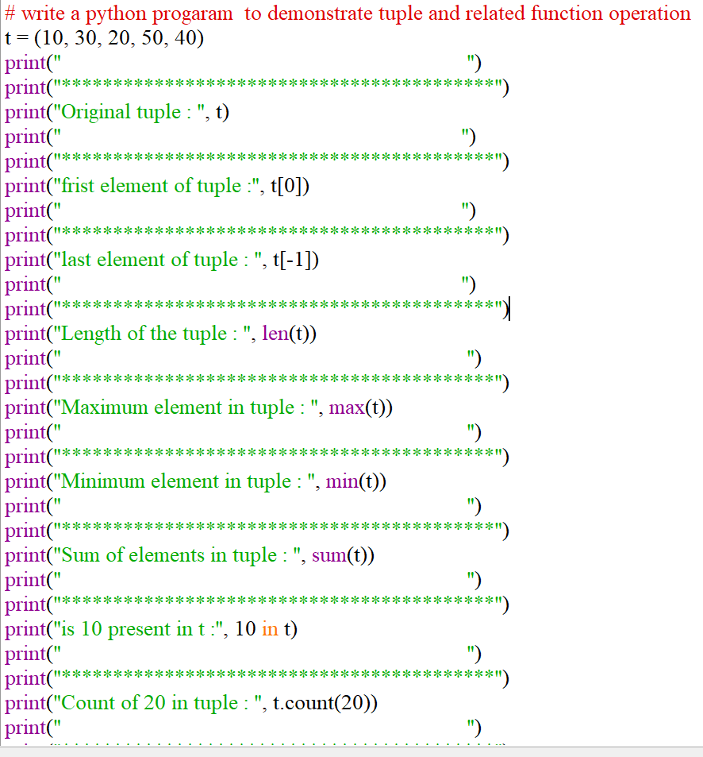
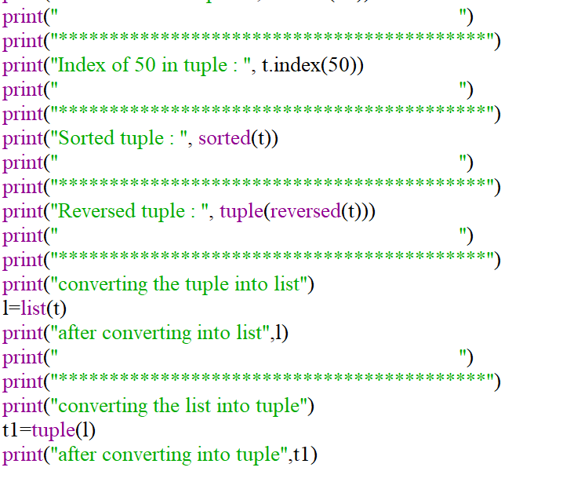
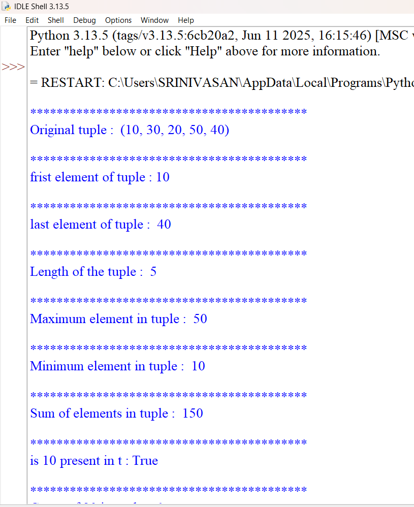
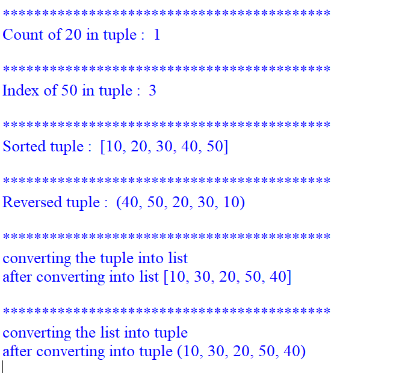

# PYTHON-LAB-EXPERIMENT-5
PYTHON PROGRAMMING LAB EXPERIMENT 5

## Aim

To write a Python program to demonstrate tuple and related functions/operations such as len(), max(), min(), sum(), count(), index(), sorted(), reversed(), membership operator, and conversion between tuple and list.

## Algorithm

1.Start the program.

2.Create a tuple t containing integer elements.

3.Display the original tuple.

4.Access and display the first element using index 0.

5.Access and display the last element using index -1.

6.Find and display the length of the tuple using len().

7.Find and display the maximum element using max().

8.Find and display the minimum element using min().

9.Calculate and display the sum of elements using sum().

10.Check whether 10 is present in the tuple using the in operator.

11.Count the occurrence of 20 using count().

12.Find the index position of 50 using index().

13.Sort the tuple elements using sorted().

14.Reverse the tuple using reversed() and convert it back to a tuple.

15.Convert the tuple into a list using list().

16.Convert the list back into a tuple using tuple().

17.Display all the results.

18.Stop the program.

## Source code

## Output

## AIM
To write a Python program to calculate an employee’s net salary by taking the employee’s name, age, and basic salary as input, calculating HRA and PF, and determining the employee’s job level based on the net salary.

## ALGORITHM

1.Start the program.

2.Define a function EmpCalc().

3.Get the employee’s name, age, and salary as input.

4.Calculate HRA as 35% of the salary.

5.Calculate PF as 25% of the salary.

6.Calculate Net Salary:
      Net Salary = Salary + HRA + PF

7.Check the net salary:

8.If net salary is between ₹30,000 and ₹1,00,000, display Senior Manager.

9.If net salary is between ₹20,000 and ₹30,000, display Manager.

10.Otherwise, display Front level job.

11.Return the employee’s name, age, and net salary.

12.Display the employee details.

13.Stop the program.

## SOURCE CODE

